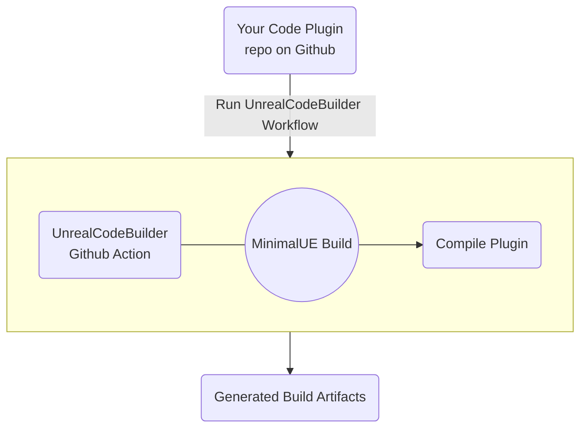

# UnrealPluginCIWithGithubActions

UnrealPluginCIWithGithubActions is a practical example on using **<ins>GitHub Actions free tier</ins>** with [UnrealCodeBuilder](https://github.com/Guganana/UnrealCodeBuilder) workflows to automate the compilation of your Code Plugins for the 3 latest Unreal Engine versions + automatically prepare them for distribution on the Unreal Engine Marketplace.

It relies heavily on [MinimalUE](https://github.com/Guganana/MinimalUE) to generate a trimmed, compressed version of Unreal Engine that can only compile projects (going from 50GB to 150MB on UE 5.1), allowing us to easily manage the engine inside the GitHub Actions environment.

Due to Unreal Engine's EULA, <ins>it's not possible to share the minimal versions of the engine publicly</ins> — thus, there will be two ways of getting this working for you:
- Creating your own MinimalUE build and hosting it privately (will be releasing a guide in the future)
- Joining our private team, which uses our internal version of MinimalUE build that can only be accessed by GitHub runners (currently only inviting select individuals)


> 😎 This repository already builds its source code every time we make a commit - [Give it a look!](https://github.com/Guganana/UnrealPluginCIWithGithubActions/actions)

**This is still an ongoing effort — we will be making it more widely available with time** 



# Getting Started:

> ❗❗ For now section only applies to people using Guganana's private version of MinimalUE.

## 1. Defining the plugin metadata

[](./.metadata)
To produce the build artifacts, [UnrealCodeBuilder workflows](https://github.com/Guganana/UnrealCodeBuilder) require you to specify additional information about the plugin (i.e. ProductName, Version, ReleaseFormat).

 For that you need to emulate the folder and file structure found in [.metadata](./.metadata) and fill the files with the relevant data for your project.
- [.metadata](./.metadata)
    - [friendlyVersion](./.metadata/friendlyVersion) | e.g: 1.0.2
    - [productName](./.metadata/productName) | e.g: MyVeryCoolPlugin
    - [releaseVersionFormat](./.metadata/releaseVersionFormat) | Dynamically evaluated (you can read other env variables) | example uses the friendlyVersion + the commit SHA -> 1.0.2(abcdef)
    - [releaseNameFormat](./.metadata/releaseNameFormat) | Dynamically evaluated | Used to generate the artifact names (IMPORTANT: make sure to always include $env:UEVersion in the string so you can diferentiate the build artifacts for each unreal version)

For advanced users, adding more files into  [.metadata](./.metadata) will converted their names and values into environment variables that can be queried by the "Format" ones

If you want to keep it simple, you can just copy the example files.

## 2. Creating the workflow:

Now you can create your own Github Actions workflow and reference [UnrealCodeBuilder's workflows](https://github.com/Guganana/UnrealCodeBuilder):

Inside ```./.github/workflows/```, create your own workflow yaml file which emulates [BuildAndGenerateArtifactsForMarketplace.yml](/.github/workflows/BuildAndGenerateArtifactsForMarketplace.yml):

https://github.com/Guganana/UnrealPluginCIWithGithubActions/blob/bc650c1e19dcde5e396fb08e3ed035f62e2b6510/.github/workflows/BuildAndGenerateArtifactsForMarketplace.yml#L1-L31

## 3. Setting up GUGANANA_BUILD_KEY and UNREALCODEBUILDER_ENGINE_ENDPOINT secrets
To make the GitHub runners to access our private MinimalUE, you're required to set up the GUGANANA_BUILD_KEY and UNREALCODEBUILDER_ENGINE_ENDPOINT secrets:
1. On your repository page, click on the settings panel.
2. Expand the ```Secrets and variables``` option on the side panel followed by ```Actions```
3. Add a new Repository Secret - the secret name should be ```GUGANANA_BUILD_KEY``` while the key is the string provided by us.
4. Create another secret for UNREALCODEBUILDER_ENGINE_ENDPOINT with the value provided by us

## 4. Done!
You can now go to the Actions Panel to manually trigger a build. You should get the build artifacts for the latest 3 engine versions if it compiles successfuly.

Make sure to download the build artifacts and upload them on your preffered file hosting service to provide the Unreal Engine Marketplace with plugin download links.

You're always free to extend your automation further and integrate it with other platforms.

# Current feature support

| Feature  | Supported  |
|---|---|
|Supported for UE versions| 4.27 \| 5.0 \| 5.1  |
|Compilation for Win64|✅|
|Automatically prepare for Marketplace release|✅|
|Compilation for MacOS|❌|
|Compilation for Linux|❌|
|Run tests after compilation|❌|

# Privacy and Telemetry disclosure
When using [UnrealCodeBuilder](https://github.com/Guganana/UnrealCodeBuilder), we send a single telemetry event containing the repository name & repository owner. This helps us gauge the usage of our tools and know how important they are to the community.

No other data is collected. Your code is safe!
