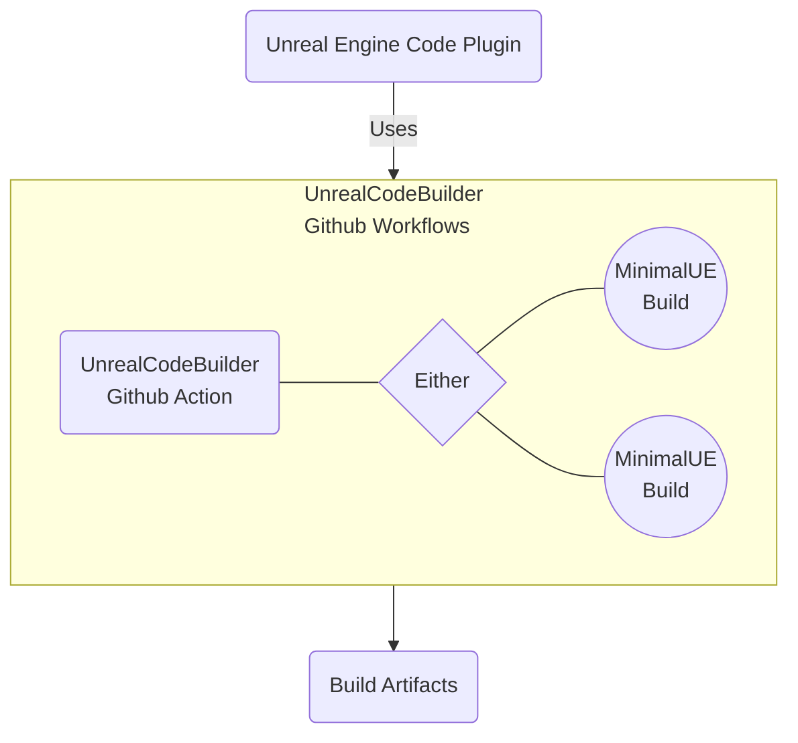

# UnrealPluginWithCI

UnrealPluginWithCI is a practical example on using <ins>Github Actions free tier</ins> with [UnrealCodeBuilder](https://github.com/Guganana/UnrealCodeBuilder) workflows to automate compilation of your Code Plugins for the 3 latest Unreal Engine versions + automatically prepping them for distribution on the Unreal Engine Marketplace.

This relies heavily on [MinimalUE](https://github.com/Guganana/MinimalUE) to generate a trimmed, compressed, compile only version of Unreal Engine (i.e. going from 50GB to 150MB on UE 5.1) so it can be trivially used inside the Github Actions environment.

Due to Unreal Engine's EULA it's not possible to share the minimal versions of the engine publicly — Thus there will be two ways of getting this working for you:
- Joining our private team which uses our internal version of MinimalUE build and makes sure they are only able to be accessed by github runners (currently only inviting select individuals)
- Creating your own MinimalUE build and hosting it privately (will be releasing a guide in the future)

**This is still an ongoing effort — we will be making it more widely available with time**

## Current feature support

| Feature  | Supported  |
|---|---|
|Supported for UE versions| 4.27/5.0/5.1  |
|Compilation for Win64|✅|
|Automatically prepare for Marketplace release|✅|
|Compilation for MacOS|❌|
|Compilation for Linux|❌|
|Run tests after compilation|❌|

