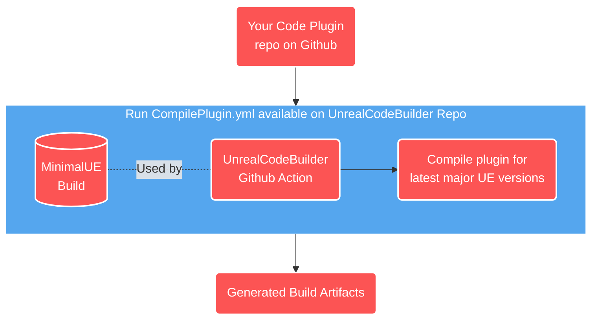

# UnrealPluginCIWithGithubActions

> ❗ For now this guide only works for people using Guganana's private MinimalUE build ([invite only](https://forms.gle/Ai9K6qVSL7mscodi6)). We do have plans on extending this further and giving people the option to create their own versions of MinimalUE.

UnrealPluginCIWithGithubActions is a practical example on using **<ins>GitHub Actions free tier</ins>** with [UnrealCodeBuilder](https://github.com/Guganana/UnrealCodeBuilder) to automate the compilation of your Code Plugins for the 3 latest Unreal Engine versions + automatically prepare them for distribution on the Unreal Engine Marketplace.

It relies heavily on our other tool, [MinimalUE](https://github.com/Guganana/MinimalUE) (WIP), to generate a trimmed and compressed version of Unreal Engine that can only compile projects (going from 50GB+ to 150MB on UE 5.1), allowing us to easily manage the engine inside the GitHub Actions environment.

Due to Unreal Engine's EULA, <ins>it's not possible to share the minimal versions of the engine publicly</ins> — thus, there will be two ways of getting this working for you:
- Creating your own MinimalUE build and hosting it privately (guide to be released in the future)
- Joining our private team, which uses our internal version of MinimalUE build that can only be accessed by GitHub Actions runners. Currently only inviting a limited number of people.

> This repository already builds its source code every time we make a commit 😎 — [Give it a look!](https://github.com/Guganana/UnrealPluginCIWithGithubActions/actions)




This is still an ongoing effort — we hope to make it more widely available with time.

# Getting Started:

## 1. Defining the plugin metadata

[](./.metadata)
To produce the build artifacts, [UnrealCodeBuilder workflows](https://github.com/Guganana/UnrealCodeBuilder) requires you to specify additional information about your plugin (i.e. ProductName, Version, ReleaseFormat).

 For that you need to recreate the folder and file structure found in [.metadata](./.metadata), filling the files with the relevant data for your project.
- [.metadata](./.metadata)
    - [friendlyVersion](./.metadata/friendlyVersion)<br/>User-friendly version of your project.<br/>e.g: ```1.0.2```
    - [productName](./.metadata/productName)<br/>Your plugin's name without any spaces.<br/>e.g: ```MyVeryCoolPlugin```
    - [releaseVersionFormat](./.metadata/releaseVersionFormat)<br/>Dynamically evaluated format string allowing you to inject extra information into your version.<br/>e.g: ```$env:friendlyVersion($($env:releaseSHA.Substring(0, 7)))``` would evaluate to ```1.0.2(abcdefg)```
    - [releaseNameFormat](./.metadata/releaseNameFormat)<br/>Dynamically evaluated format string used to generate the artifact names.<br/>e.g: ```$env:productName-$env:releaseVersion@$env:UEVersion``` would evaluate to ```MyVeryCoolPlugin-1.0.2(abcdefg)@5.1```<br/>**Make sure to always include $env:UEVersion in the string so you can diferentiate the build artifacts for each Unreal version**

For advanced users, adding more files into  [.metadata](./.metadata) will turn their names/values into environment variables that can be queried by the "format" metadata files.

If you want to keep it simple, you can just copy the example files.

## 2. Creating the workflow:

Now you can create your own Github Actions workflow and reference [UnrealCodeBuilder's workflows](https://github.com/Guganana/UnrealCodeBuilder):

On your repository, inside ```./.github/workflows/```, create your own workflow yaml file which replicates [BuildAndGenerateArtifactsForMarketplace.yml](/.github/workflows/BuildAndGenerateArtifactsForMarketplace.yml):

https://github.com/Guganana/UnrealPluginCIWithGithubActions/blob/9cceb57170e644c0b9295d417fe107e835c99484/.github/workflows/BuildAndGenerateArtifactsForMarketplace.yml#L1-L34

## 3. Setting up the secrets
To make the GitHub runners access our private MinimalUE build, you're required to set up the ```GUGANANA_BUILD_KEY``` and ```UNREALCODEBUILDER_ENGINE_ENDPOINT``` secrets:
1. On your repository page, click on the settings panel.
2. Expand the ```Secrets and variables``` option on the side panel followed by ```Actions```.
3. Add a new Repository Secret - the secret name should be ```GUGANANA_BUILD_KEY``` while the key is the string provided by us.
4. Create another secret for ```UNREALCODEBUILDER_ENGINE_ENDPOINT``` with the value provided by us.

## 4. Done!
You can now go to the Actions Panel to manually trigger a build. You should get the build artifacts for the latest 3 engine versions if it compiles successfuly.

Make sure to download the build artifacts and upload them to your preferred file hosting service so you can generate download links for the Unreal Engine Marketplace.

You're always free to extend your automation further and integrate it with other platforms.

# Current feature support

| Feature  | Supported  |
|---|---|
|Supported for UE versions| 4.27 \| 5.0 \| 5.1  |
|Compilation for Win64|✅|
|Automatically prepare for Marketplace release|✅|
|Run tests after compilation|❌ not yet|
|Compilation for MacOS|❌ not yet|
|Compilation for Linux|❌ not yet|
|Generate Precompiled binaries able to be distributed|❌ not yet|
|Automatically deploy to File Hosting services|❌ not yet|

# Privacy and Telemetry disclosure
When using [UnrealCodeBuilder](https://github.com/Guganana/UnrealCodeBuilder), we send a single telemetry event containing the repository name & repository owner. This helps us gauge the usage of our tools and know how important they are to the community.

No other data is collected. Your code is safe!
